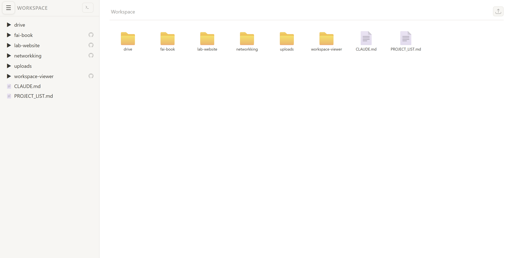
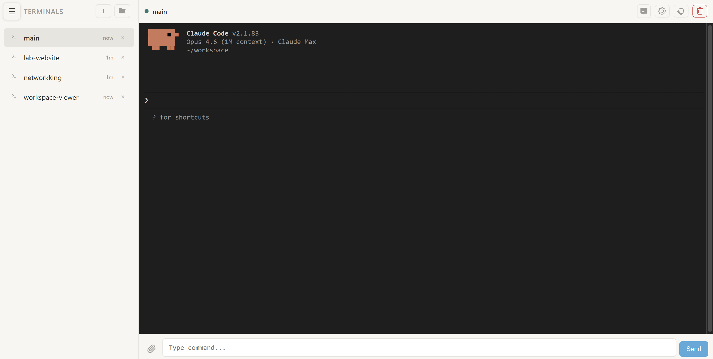
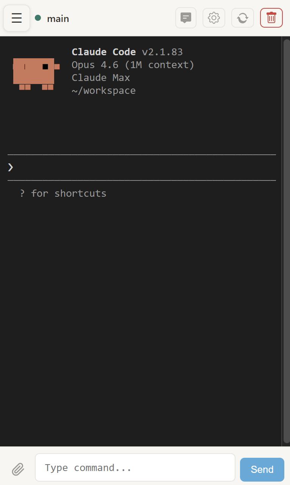

# Claude Notebook

[한국어](README_KR.md)

A Jupyter Notebook extension that adds a **Notion-like file browser** and **terminal management UI** — designed as a lightweight, self-hosted alternative to Claude Code Remote.

> **Blog Post**: [English](https://trustworthyai.co.kr/article/2026/claude-notebook-eng/) | [한국어](https://trustworthyai.co.kr/article/2026/claude-notebook/)

## Quick Start

```bash
Install Git
Install Claude Code
Ask your Claude Code to install "https://github.com/Harry24k/claude-notebook/" from the address below
```

Then visit `http://localhost:8888/claude-notebook` in your browser.

## Features

| Feature | Description |
|---|---|
| **File Browser** | Notion-style workspace navigation with syntax highlighting, Markdown rendering, image preview, and inline editing |
| **CSV Viewer** | Interactive table with column sorting, filtering, resizable columns, row coloring, and cell copy |
| **Terminal Manager** | Create, rename, configure, and switch between multiple persistent terminal sessions |
| **Chat Mode** | iMessage-style chat view that renders terminal output as conversation bubbles with ANSI color support |
| **File Upload** | Drag-and-drop file/folder upload with automatic filename collision handling |
| **Server Config** | Terminal names, startup commands, chat mode, and CSV settings persist on the server |
| **Mobile Ready** | Fully responsive with touch-optimized UI, collapsible sidebar, and terminal copy support |
| **Claude Code Ready** | Run multiple Claude Code instances simultaneously in separate terminals |
| **Zero Config** | Automatically uses Jupyter's `notebook_dir` as the workspace path |

## Screenshots

#### File Browser (Desktop / Mobile)

<p>
  
  
</p>

#### Terminal Manager (Desktop / Mobile)

<p>
  
  
</p>

## Requirements

- Python 3
- Jupyter Notebook 6.x
- Tornado

All dependencies are managed via `requirements.txt`.

## License

See [LICENSE](LICENSE) for details.
